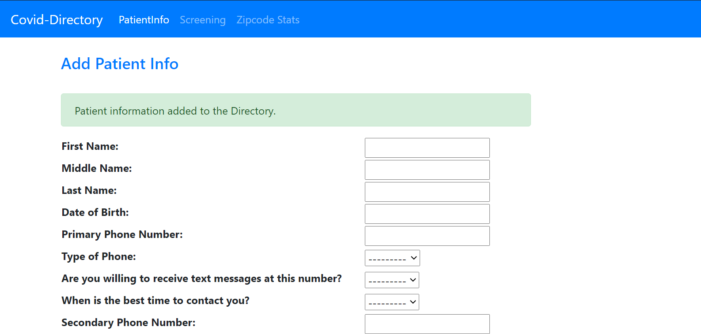

# Covid-Directory

## What is Covid Directory?
Covid Directory is a Software prototype that allows healthcare organizations to record and maintain informations about the patients. 

Designed in a way that the codebase can be easily extended and additional features such as analytics can be added.

## Stack
- Python 3.8
- Django
- Django REST Framework
## Features
- Dashboard 
- Authentication and Administration (Login and Authorizartion)
- Patient record entry form
- Eligibility Screening form
- RESTFul API Endpoints
- Zipcode Analytics
## How to build it?
1. Clone this repository in your local machine.
2. Install dependencies.
  ```
  pip install requirements.txt
  npm install
  ```
3. Make migrations and migrate the tables by running the following command:
  ```
  python core\manage.py migrate
  ```
4. Start the server by running the following command:
  ```
  python core\manange.py runserver
  ```
5. Open https://localhost:8000/ in browser to start using the Covid-Directory.
  ## REST API Endpoints:
  ### Add and Fetch Patient information
  ```/api/patientinfo```
  
  Methods: **GET**, **POST**

  ### Add, fetch and determine Eligibility Screening
  ```/api/screen```
  
  Methods: **GET**, **POST**

## Screenshots




## Additional Information
If you have any additional questions, feedbacks, suggestions or recommendations, feel free to contact me through [Email](mailto:connectwith@laxmena.com) or [LinkedIn](https://www.linkedin.com/in/lakshmanan-meiyappan).

Visit my blog here: [https://laxmena.com](https://laxmena.com).